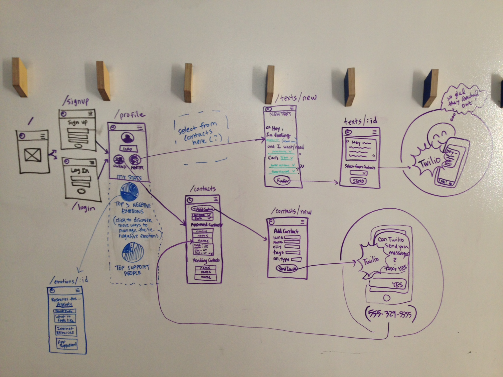
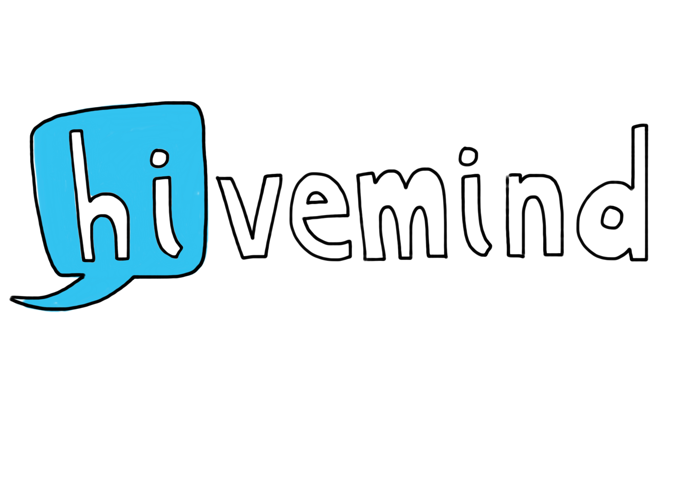
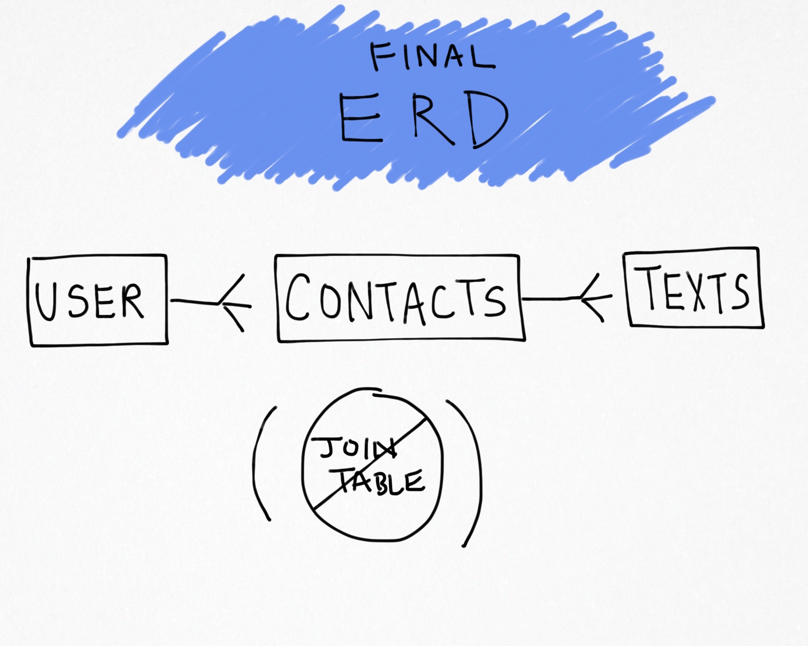
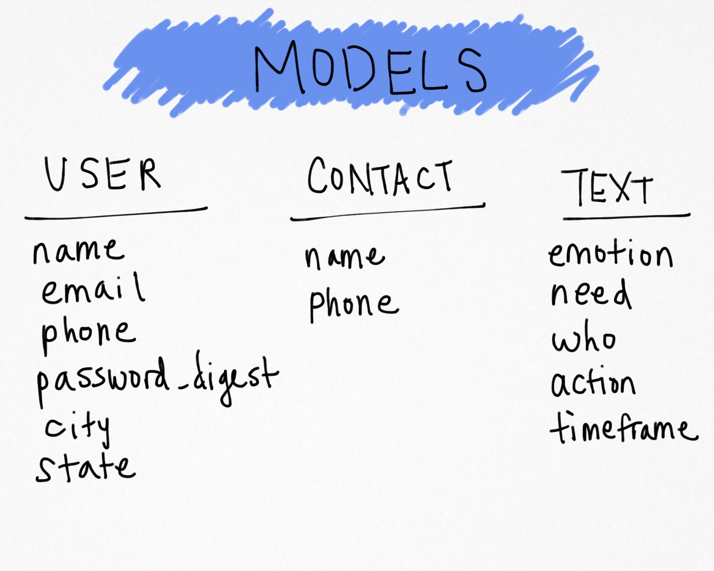
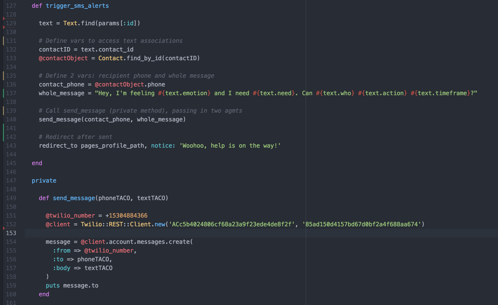
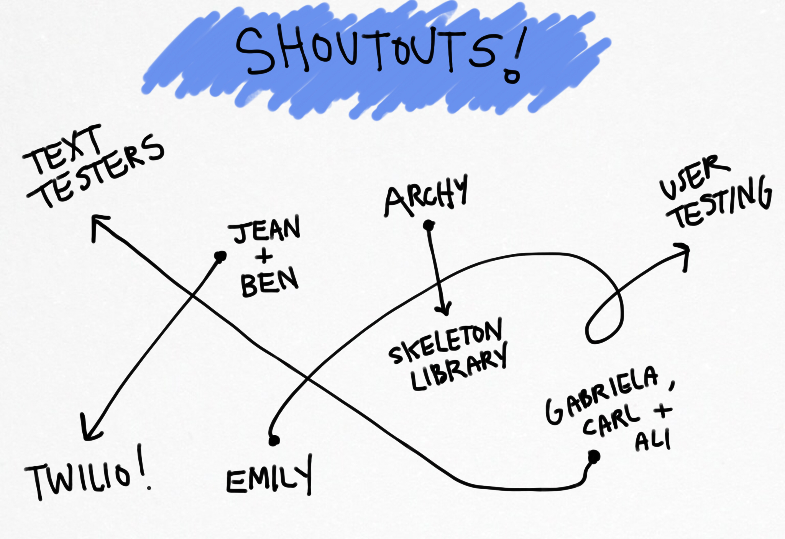
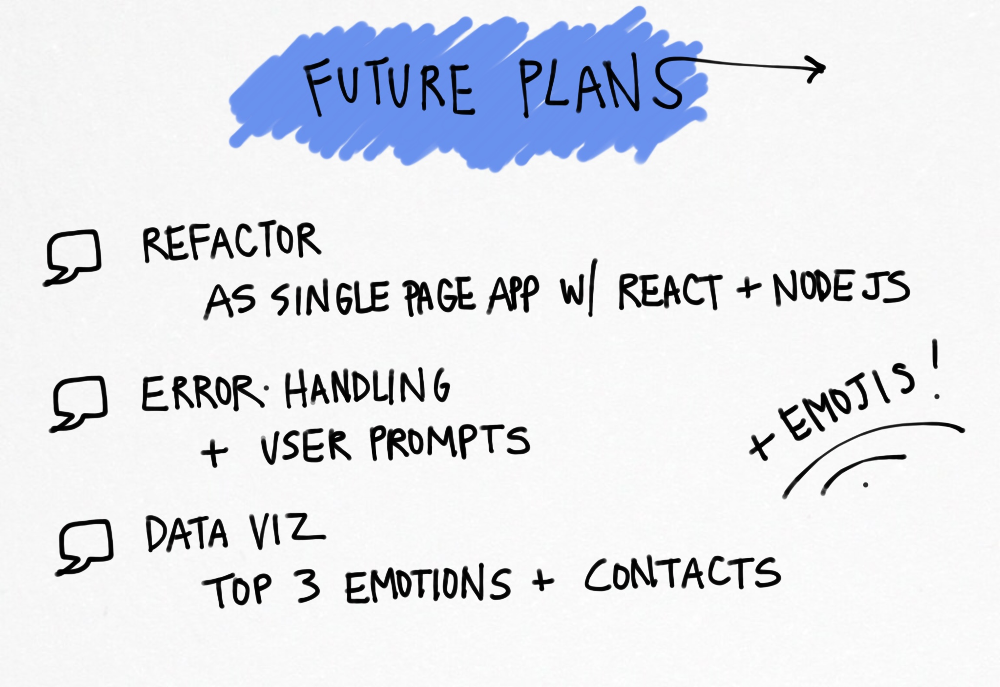

## About Hivemind

A mental health and self-improvement app built for the web. Using best practices in healthy communication, Hivemind enables users to add contacts from their real-life support networks, build a well-worded request with our tool that helps each user figure out exactly what they are feeling and what they need in that moment, and then seamlessly send that request as a text message to their contact/s of choice. Users can track emotional trends and access additional resources to build healthy habits after generating data about themselves through the app.

# Wireframes & User Stories

- [Wireframes](https://app.moqups.com/cmangold/QOGkiGIPCQ/view/page/ad64222d5?ui=0)
*Honor system; please leave the editing to me* :)

- User stories: 

# Tech

- Front-end: Skeleton
- Back-end: Ruby on Rails
- Auth: bcrypt
- SMS: Twilio

# Wishlist / Future Development Plans

### Forms
- Modify form fields in "new text" form so that user has option to fill empty text field with custom data, or to choose from a selection (dropdown)
- Emoji and photo (mms) options to "new text" form
- Form validation and error handling

### Design
- Refactor as a single-page app using React and Node.js

### Features
- Add data visualization on profile page: 3 top emotions and 3 top contacts. Emotions: link to in-app resource page with information and more resources online. Contacts: add ability to send those contacts a special thank you / celebration text.
- Add group tags to find and select multiple contacts for group messaging
- Administrator auth

# Additional Information

# Built by Chelsea Mangold

- https://twitter.com/narriteration
- https://github.com/narriteration
